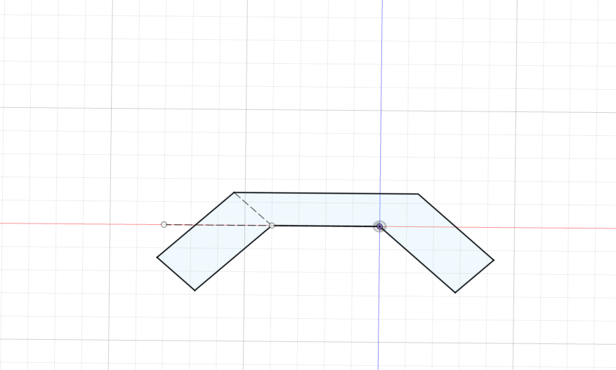
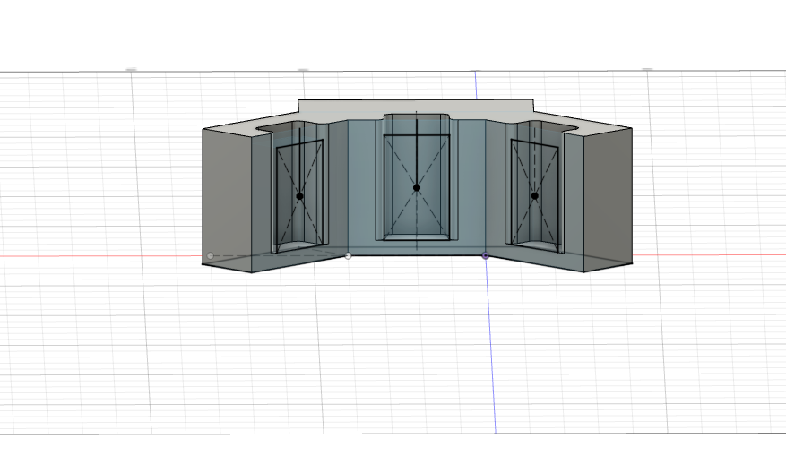
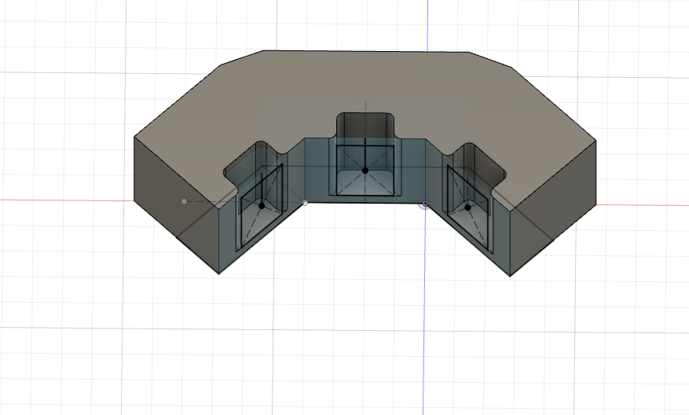
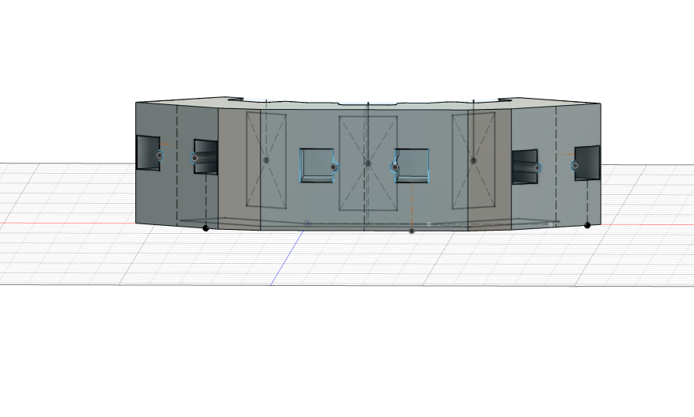
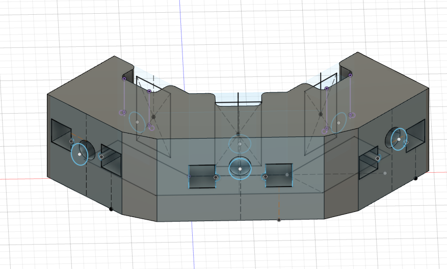
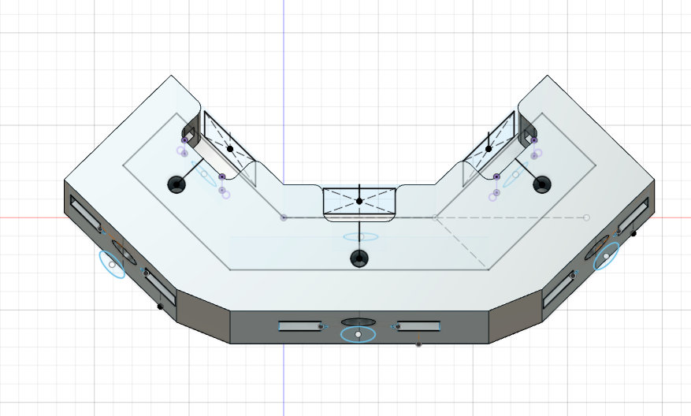
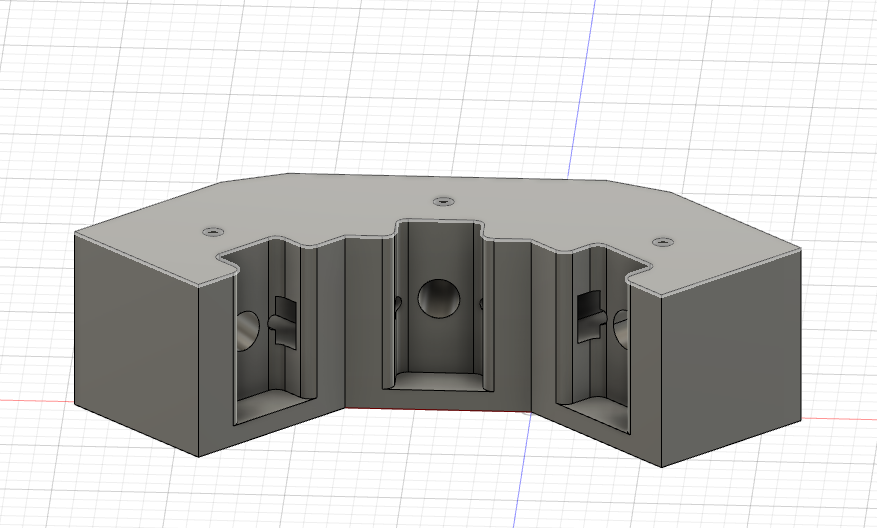

# Designing and Creating the Response Port Manifold

#### By Josh Wilson

###  Design goals 

In the realm of rodent behavioral studies there have been many different tools to help researchers unveil the different secrets of the brain and its connections to specific behaviors, some of those tools like the morris water maze, radial arm maze, and behavioral boxes have remained somewhat unchanged for years. However, with the advent of new technologies like 3D printers and lazer cutters, this allows for a more specific and dynamic approach to the creation of behavioral tools. No longer is it necessary to contact an engineer at a manufactoring warehouse to be able to create your own behavioral tool or modify an existing one. In this case, the purpose of this tool is to further modify a behavioral box, which may contain multiple spouts, but are often a distance apart and may require the subject to change its behavior thus affect the accuracy of the test. Creating an invidudual spout with three ports allows for the subject to make instaneous decisions based on the given parameters and minimizes the necessary movements it has to make to obtain a reward. This design is easily maipluated and can be changed to fit in any form of behavioral device, making it a useful tool for a multitude of stuides. The ports were also designed with the idea that they would be used in conjunction with photobeams which would allow the detection of licking or nosepoking. 

### Design parameters 

####	Tools

The designing process or CAD (computer aided design) was performed in fusion 360 under an education liscence, it was sliced using cura, and it was printed on a prusa MKII. There are many different types of printers and CAD/CAM programs however, these two in specific were what was available and, regarding fusion 360 specifically, is arguably the best and easiest software to use for CAD. Overall, the only required things to create and print this tool is a slicer and a 3D printer, but if any modifications are necessary then a CAD tool like fusion is also required. 

#### 	Step-By-Step 

1. The first step in creating the spout was to create the body itself, this was done by using three rectangles, a central rectangle had two other identical rectangles attached at both ends of it. The attached rectanlges were angled at 45 degrees. 

   

2. Next, after extruding the sketch 40mm, three 19x31mm rectanlges were sketched on each face the center of the rectangles were place 20mm from the top of the body. The faces were then used to remove 10mm of material from the body. After creating the cavity, the roof of each space was removed and the corners of the cavity were fileted 

   

3. Depening on how the intial sketch was drawn this step may or may not be necssary, but to make sure the port would be able to fit the spouts, the backside of the body was extended 20mm on each side then lofted to connect the space between the newly extended spaces. 

    

4. Then on the backside of each side the outline of photobeams was sketched using a square/rectangle and a circle. Then using the sketch, the cavity that would house the photobeams was created. The dimensions used for the square was 11x11mm and the circle was 3.5mm in diameter which was placed at the midpoint of what would become the inner side of the sketch. 

   

5. The a 9mm circle was sketch on a plane that was angle 15 degrees toward the body and another 9mm cirlce was placed at the face of the rectangular cavity, then the space between the two circles was removed using a loft, thus creating the space the spout would sit. this was repeated for all three sides. 

   

6. Finally, 4.5mm circles were sketched on the roof of the body, 10mm from the rectangluar cavity's midpoint. Then 17mm of material was removed from the holes. These holes allowed for screws to hold the spout in place. 

### Summary 

The response port manifold was created to fit a specific goal in behavioral rat research, that goal was to simplify and condense a rats ability to choose, thus, ensuring accuracy in their choice. This device can be used in many different forms of experiments and can be altered to better fit other scenarios. The hope in creating this device and outlining its creation is, not only to encourage its use in the scientific field, but to also encourage the development and subsequent sharing of new and useful techniques and devices which will further advance the field of neuroscience. 

